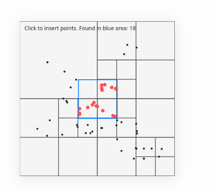

# Quadtree

**Quadtree** is an interactive p5.js quadtree visualization that makes spatial partitioning easy to see, click, and understand.

Click on the canvas to add points, watch the space split into quadrants, and move the mouse to query nearby points in real time.

## Preview



## What It Shows

Quadtree demonstrates how a quadtree organizes 2D space.

Instead of checking every point on the canvas, the quadtree divides the canvas into smaller rectangles. When you search an area, it skips rectangles that cannot contain useful points and checks only the relevant regions.

## Features

- Interactive p5.js canvas
- Click-to-insert points with `mouseX` and `mouseY`
- Recursive quadtree subdivision
- Visual quadtree boundaries
- Mouse-following search rectangle
- Highlighted query results
- Clean `Point`, `Rectangle`, and `QuadTree` classes
- Input validation for safer geometry logic

## How It Works

The project is built around three core classes:

- `Point`: stores an `x`, `y`, and optional data payload.
- `Rectangle`: represents a boundary or search area using center coordinates and half-size.
- `QuadTree`: stores points, subdivides into four child nodes, and supports range queries.

The search box follows the mouse. Every frame, the quadtree asks:

```text
Which stored points are inside this rectangle?
```

The quadtree answers efficiently by skipping branches whose boundaries do not intersect the search area.

## Running Locally

Open `index.html` in a browser.

No build step is required. The project uses p5.js from a CDN.

## Project Files

```text
index.html                         p5.js page entry
style.css                          basic page styling
sketch.js                          canvas interaction and drawing
board.js                           Point, Rectangle, and QuadTree implementation
LICENSE                            MIT license
```

## License

MIT License. See `LICENSE` for details.
